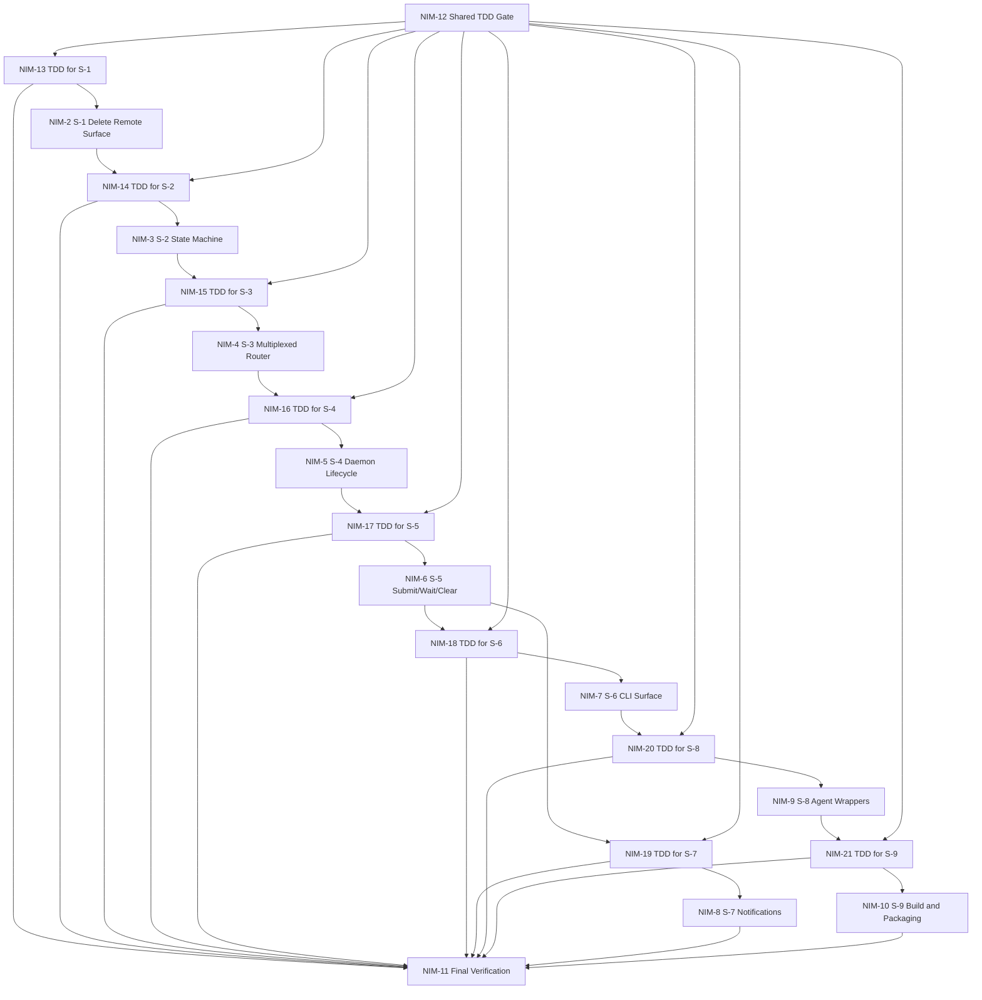

# Plannotator

A plan review UI for Claude Code that intercepts `ExitPlanMode` via hooks, letting users approve or request changes with annotated feedback. Also provides code review for git diffs and annotation of arbitrary markdown files.

## Task Complexity And Model Routing

Use a `complexityScore` on a 0-100 scale to decide which model and reasoning
effort should own a task.

### Complexity rubric

- `0-20`: Trivial, tightly bounded, low ambiguity, easy to verify
- `21-40`: Small implementation task, limited coupling, cheap mistakes
- `41-60`: Moderate multi-step task, some refactor or coordination burden
- `61-80`: High complexity, cross-module work, real ambiguity, meaningful
  verification burden
- `81-100`: Architecture-level or correctness-critical work with broad coupling,
  recovery concerns, or expensive failure modes

### Routing table

- `0-20` → `gpt-5.4-mini` at `medium`
- `21-45` → `gpt-5.4` at `medium`
- `46-65` → `gpt-5.4` at `high`
- `66-80` → `GPT-5.5` at `medium`
- `81-90` → `GPT-5.5` at `high`
- `91-100` → `GPT-5.5` at `xhigh`

### Override rules

- Prefer `GPT-5.5` earlier than the table suggests when failure creates
  meaningful cleanup debt or negative progress.
- Prefer `GPT-5.5` at `high` or `xhigh` for architecture, state machines,
  concurrency, recovery, migration, delegation-heavy work, or tasks prone to
  gaming, drift, or shallow shortcutting.
- Prefer `gpt-5.4` when the work is fully specified, locally verifiable, and a
  later `GPT-5.5` audit or patch pass is cheaper than running `GPT-5.5` as the
  primary implementer for the entire task.
- Do not route difficult tasks to older or weaker models just to save usage if
  the likely result is review debt, rewrite debt, or false confidence.

## Current Task Poset

Tracker plan: `NIM-1`



## Delegation Workflows

When a task is delegated to a subagent, treat that delegation as the active
execution path unless the delegate is explicitly replaced or abandoned.

### Blocking delegation

Use this for real implementation, proof-authoring, refactors, and other
substantive tasks where overlapping work would create confusion or duplicate
effort.

- Create a git checkpoint commit before assigning the task to a subagent.
- Assign the task to a single subagent with a bounded scope.
- Do not work on the same task locally while the subagent owns it.
- Do not treat a polling timeout as permission to take over the task.
- Wait until the subagent actually reports completion, then review the result.
- After review, either accept the work, request changes, or explicitly replace
  the delegate.
- When the subagent is done, stage and commit the full delegated change as one
  unit before final acceptance.
- Review the resulting git diff or commit diff to ensure the work actually
  matches the assigned task and did not drift or game the request.

### Status polling

Timed waits are allowed only for status checks. They are not completion signals.

- A timed wait expiring means only: no result has been returned yet.
- It does not mean the subagent failed.
- It does not mean the task should be taken over locally.
- It does not mean overlapping work is now acceptable.

### Delegate replacement

If a delegated task must be rerouted:

- Explicitly abandon or replace the current delegate.
- Record the reassignment in the tracker.
- Send the replacement delegate the full task specification, concrete repo
  context, success criteria, non-goals, and write-scope boundaries.
- Only after explicit replacement may a different agent or the main agent take
  over the task.

### Handoff requirements

Do not compress the task into a vague summary when delegating.

- Give the delegate the full task specification, ideally verbatim from the
  tracker or plan.
- Include the task's place in the dependency order or poset when that affects
  sequencing or scope.
- Include concrete repo entry points, relevant files, and expected proof or
  verification commands.
- State the expected deliverable format: changed files, verification run,
  blockers, and unresolved questions.
- State non-goals explicitly so the delegate does not wander into adjacent work.

### Lessons learned

- A status polling timeout is not a completion signal.
- No local overlap is allowed while a delegate still owns the task.
- A missing or delayed result should trigger better orchestration, not silent
  takeover of the task.
- Delegates need the full task specification, not a compressed paraphrase.
- Delegated work should be checkpointed before handoff and committed as a unit
  when returned so the diff can be reviewed against task compliance.

## Project Structure

```
plannotator/
├── apps/
│   ├── hook/                     # Claude Code plugin
│   │   ├── .claude-plugin/plugin.json
│   │   ├── commands/             # Slash commands (plannotator-review.md, plannotator-annotate.md)
│   │   ├── hooks/hooks.json      # PermissionRequest hook config
│   │   ├── server/index.ts       # Entry point (plan + review + annotate subcommands)
│   │   └── dist/                 # Built single-file apps (index.html, review.html)
│   ├── opencode-plugin/          # OpenCode plugin
│   │   ├── commands/             # Slash commands (plannotator-review.md, plannotator-annotate.md)
│   │   ├── index.ts              # Plugin entry with submit_plan tool + review/annotate event handlers
│   │   ├── plannotator.html      # Built plan review app
│   │   └── review-editor.html    # Built code review app
│   ├── marketing/                # Marketing site, docs, and blog (plannotator.ai)
│   │   └── astro.config.mjs      # Astro 5 static site with content collections
│   ├── paste-service/            # Paste service for short URL sharing
│   │   ├── core/                 # Platform-agnostic logic (handler, storage interface, cors)
│   │   ├── stores/               # Storage backends (fs, kv, s3)
│   │   └── targets/              # Deployment entries (bun.ts, cloudflare.ts)
│   ├── review/                   # Standalone review server (for development)
│   │   ├── index.html
│   │   ├── index.tsx
│   │   └── vite.config.ts
│   └── vscode-extension/         # VS Code extension — opens plans in editor tabs
│       ├── bin/                   # Router scripts (open-in-vscode, xdg-open)
│       ├── src/                   # extension.ts, cookie-proxy.ts, ipc-server.ts, panel-manager.ts, editor-annotations.ts, vscode-theme.ts
│       └── package.json           # Extension manifest (publisher: backnotprop)
├── packages/
│   ├── server/                   # Shared server implementation
│   │   ├── index.ts              # startPlannotatorServer(), handleServerReady()
│   │   ├── review.ts             # startReviewServer(), handleReviewServerReady()
│   │   ├── annotate.ts           # startAnnotateServer(), handleAnnotateServerReady()
│   │   ├── storage.ts            # Plan saving to disk (getPlanDir, savePlan, etc.)
│   │   ├── share-url.ts          # Server-side share URL generation for remote sessions
│   │   ├── remote.ts             # isRemoteSession(), getServerPort()
│   │   ├── browser.ts            # openBrowser()
│   │   ├── draft.ts              # Annotation draft persistence (~/.plannotator/drafts/)
│   │   ├── integrations.ts       # Obsidian, Bear integrations
│   │   ├── ide.ts                # VS Code diff integration (openEditorDiff)
│   │   ├── editor-annotations.ts  # VS Code editor annotation endpoints
│   │   └── project.ts            # Project name detection for tags
│   ├── ui/                       # Shared React components
│   │   ├── components/           # Viewer, Toolbar, Settings, etc.
│   │   │   ├── plan-diff/        # PlanDiffBadge, PlanDiffViewer, clean/raw diff views
│   │   │   └── sidebar/          # SidebarContainer, SidebarTabs, VersionBrowser
│   │   ├── utils/                # parser.ts, sharing.ts, storage.ts, planSave.ts, agentSwitch.ts, planDiffEngine.ts
│   │   ├── hooks/                # useSharing.ts, usePlanDiff.ts, useSidebar.ts, useLinkedDoc.ts, useAnnotationDraft.ts, useCodeAnnotationDraft.ts
│   │   └── types.ts
│   ├── shared/                   # Cross-package types (EditorAnnotation)
│   ├── editor/                   # Plan review App.tsx
│   └── review-editor/            # Code review UI
│       ├── App.tsx               # Main review app
│       ├── components/           # DiffViewer, FileTree, ReviewPanel
│       ├── demoData.ts           # Demo diff for standalone mode
│       └── index.css             # Review-specific styles
├── .claude-plugin/marketplace.json  # For marketplace install
└── legacy/                       # Old pre-monorepo code (reference only)
```

## Installation

**Via plugin marketplace** (when repo is public):

```
/plugin marketplace add backnotprop/plannotator
```

**Local testing:**

```bash
claude --plugin-dir ./apps/hook
```

## Environment Variables

| Variable | Description |
| --- | --- |
| `PLANNOTATOR_REMOTE` | Set to `1` or `true` for remote mode (devcontainer, SSH). Uses fixed port and skips browser open. |
| `PLANNOTATOR_PORT` | Fixed port to use. Default: random locally, `19432` for remote sessions. |
| `PLANNOTATOR_BROWSER` | Custom browser to open plans in. macOS: app name or path. Linux/Windows: executable path. |
| `PLANNOTATOR_SHARE_URL` | Custom base URL for share links (self-hosted portal). Default: `https://share.plannotator.ai`. |
| `PLANNOTATOR_PASTE_URL` | Base URL of the paste service API for short URL sharing. Default: `https://plannotator-paste.plannotator.workers.dev`. |

**Legacy:** `SSH_TTY` and `SSH_CONNECTION` are still detected. Prefer `PLANNOTATOR_REMOTE=1` for explicit control.

**Devcontainer/SSH usage:**
```bash
export PLANNOTATOR_REMOTE=1
export PLANNOTATOR_PORT=9999
```

## Plan Review Flow

```
Claude calls ExitPlanMode
        ↓
PermissionRequest hook fires
        ↓
Bun server reads plan from stdin JSON (tool_input.plan)
        ↓
Server starts on random port, opens browser
        ↓
User reviews plan, optionally adds annotations
        ↓
Approve → stdout: {"hookSpecificOutput":{"decision":{"behavior":"allow"}}}
Deny    → stdout: {"hookSpecificOutput":{"decision":{"behavior":"deny","message":"..."}}}
```

## Code Review Flow

```
User runs /plannotator-review command
        ↓
Claude Code: plannotator review subcommand runs
OpenCode: event handler intercepts command
        ↓
git diff captures unstaged changes
        ↓
Review server starts, opens browser with diff viewer
        ↓
User annotates code, provides feedback
        ↓
Send Feedback → feedback sent to agent session
Approve → "LGTM" sent to agent session
```

## Annotate Flow

```
User runs /plannotator-annotate <file.md> command
        ↓
Claude Code: plannotator annotate subcommand runs
OpenCode: event handler intercepts command
        ↓
Markdown file read from disk
        ↓
Annotate server starts (reuses plan editor HTML with mode:"annotate")
        ↓
User annotates markdown, provides feedback
        ↓
Send Annotations → feedback sent to agent session
```

## Server API

### Plan Server (`packages/server/index.ts`)

| Endpoint | Method | Purpose |
| --- | --- | --- |
| `/api/plan` | GET | Returns `{ plan, origin, previousPlan, versionInfo }` |
| `/api/plan/version` | GET | Fetch specific version (`?v=N`) |
| `/api/plan/versions` | GET | List all versions of current plan |
| `/api/plan/history` | GET | List all plans in current project |
| `/api/approve` | POST | Approve plan (body: planSave, agentSwitch, obsidian, bear, feedback) |
| `/api/deny` | POST | Deny plan (body: feedback, planSave) |
| `/api/image` | GET | Serve image by path query param |
| `/api/upload` | POST | Upload image, returns `{ path, originalName }` |
| `/api/obsidian/vaults` | GET | Detect available Obsidian vaults |
| `/api/reference/obsidian/files` | GET | List vault markdown files as nested tree (`?vaultPath=<path>`) |
| `/api/reference/obsidian/doc` | GET | Read a vault markdown file (`?vaultPath=<path>&path=<file>`) |
| `/api/plan/vscode-diff` | POST | Open diff in VS Code (body: baseVersion) |
| `/api/doc` | GET | Serve linked .md/.mdx file (`?path=<path>`) |
| `/api/draft` | GET/POST/DELETE | Auto-save annotation drafts to survive server crashes |
| `/api/editor-annotations` | GET | List editor annotations (VS Code only) |
| `/api/editor-annotation` | POST/DELETE | Add or remove an editor annotation (VS Code only) |

### Review Server (`packages/server/review.ts`)

| Endpoint | Method | Purpose |
| --- | --- | --- |
| `/api/diff` | GET | Returns `{ rawPatch, gitRef, origin }` |
| `/api/file-content` | GET | Returns `{ oldContent, newContent }` for expandable diff context |
| `/api/git-add` | POST | Stage/unstage a file (body: `{ filePath, undo? }`) |
| `/api/feedback` | POST | Submit review (body: feedback, annotations, agentSwitch) |
| `/api/image` | GET | Serve image by path query param |
| `/api/upload` | POST | Upload image, returns `{ path, originalName }` |
| `/api/draft` | GET/POST/DELETE | Auto-save annotation drafts to survive server crashes |
| `/api/editor-annotations` | GET | List editor annotations (VS Code only) |
| `/api/editor-annotation` | POST/DELETE | Add or remove an editor annotation (VS Code only) |

### Annotate Server (`packages/server/annotate.ts`)

| Endpoint | Method | Purpose |
| --- | --- | --- |
| `/api/plan` | GET | Returns `{ plan, origin, mode: "annotate", filePath }` |
| `/api/feedback` | POST | Submit annotations (body: feedback, annotations) |
| `/api/image` | GET | Serve image by path query param |
| `/api/upload` | POST | Upload image, returns `{ path, originalName }` |
| `/api/draft` | GET/POST/DELETE | Auto-save annotation drafts to survive server crashes |

All servers use random ports locally or fixed port (`19432`) in remote mode.

### Paste Service (`apps/paste-service/`)

| Endpoint | Method | Purpose |
| --- | --- | --- |
| `/api/paste` | POST | Store compressed plan data, returns `{ id }` |
| `/api/paste/:id` | GET | Retrieve stored compressed data |

Runs as a separate service on port `19433` (self-hosted) or as a Cloudflare Worker (hosted).

## Plan Version History

Every plan is automatically saved to `~/.plannotator/history/{project}/{slug}/` on arrival, before the user sees the UI. Versions are numbered sequentially (`001.md`, `002.md`, etc.). The slug is derived from the plan's first `# Heading` + today's date via `generateSlug()`, scoped by project name (git repo or cwd). Same heading on the same day = same slug = same plan being iterated on. Identical resubmissions are deduplicated (no new file if content matches the latest version).

This powers the version history API (`/api/plan/version`, `/api/plan/versions`, `/api/plan/history`) and the plan diff system.

History saves independently of the `planSave` user setting (which controls decision snapshots in `~/.plannotator/plans/`). Storage functions live in `packages/server/storage.ts`, with Node-compatible duplicates in `apps/pi-extension/server.ts`. Slug format: `{sanitized-heading}-YYYY-MM-DD` (heading first for readability).

## Plan Diff

When a user denies a plan and Claude resubmits, the UI shows what changed between versions. A `+N/-M` badge appears below the document card; clicking it toggles between normal view and diff view.

**Diff engine** (`packages/ui/utils/planDiffEngine.ts`): Uses the `diff` npm package (`diffLines()`) to compute line-level diffs. Groups consecutive remove+add into "modified" blocks. Returns `PlanDiffBlock[]` and `PlanDiffStats`.

**Two view modes** (toggle via `PlanDiffModeSwitcher`):
- **Rendered** (`PlanCleanDiffView`): Color-coded left borders — green (added), red (removed/strikethrough), yellow (modified)
- **Raw** (`PlanRawDiffView`): Monospace `+/-` lines, git-style

**State** (`packages/ui/hooks/usePlanDiff.ts`): Manages base version selection, diff computation, and version fetching. The server sends `previousPlan` with the initial `/api/plan` response; the hook auto-diffs against it. Users can select any prior version from the sidebar Version Browser.

**Sidebar** (`packages/ui/hooks/useSidebar.ts`): Shared left sidebar with two tabs — Table of Contents and Version Browser. The "Auto-open Sidebar" setting controls whether it opens on load (TOC tab only).

## Data Types

**Location:** `packages/ui/types.ts`

```typescript
enum AnnotationType {
  DELETION = "DELETION",
  INSERTION = "INSERTION",
  REPLACEMENT = "REPLACEMENT",
  COMMENT = "COMMENT",
  GLOBAL_COMMENT = "GLOBAL_COMMENT",
}

interface ImageAttachment {
  path: string;   // temp file path
  name: string;   // human-readable label (e.g., "login-mockup")
}

interface Annotation {
  id: string;
  blockId: string;
  startOffset: number;
  endOffset: number;
  type: AnnotationType;
  text?: string; // For comment/replacement/insertion
  originalText: string; // The selected text
  createdA: number; // Timestamp
  author?: string; // Tater identity
  images?: ImageAttachment[]; // Attached images with names
  startMeta?: { parentTagName; parentIndex; textOffset };
  endMeta?: { parentTagName; parentIndex; textOffset };
}

interface Block {
  id: string;
  type: "paragraph" | "heading" | "blockquote" | "list-item" | "code" | "hr";
  content: string;
  level?: number; // For headings (1-6)
  language?: string; // For code blocks
  order: number;
  startLine: number;
}
```

## Markdown Parser

**Location:** `packages/ui/utils/parser.ts`

`parseMarkdownToBlocks(markdown)` splits markdown into Block objects. Handles:

- Headings (`#`, `##`, etc.)
- Code blocks (``` with language extraction)
- List items (`-`, `*`, `1.`)
- Blockquotes (`>`)
- Horizontal rules (`---`)
- Paragraphs (default)

`exportAnnotations(blocks, annotations, globalAttachments)` generates human-readable feedback for Claude. Images are referenced by name: `[image-name] /tmp/path...`.

## Annotation System

**Selection mode:** User selects text → toolbar appears → choose annotation type
**Redline mode:** User selects text → auto-creates DELETION annotation

Text highlighting uses `web-highlighter` library. Code blocks use manual `<mark>` wrapping (web-highlighter can't select inside `<pre>`).

## URL Sharing

**Location:** `packages/ui/utils/sharing.ts`, `packages/ui/hooks/useSharing.ts`

Shares full plan + annotations via URL hash using deflate compression. For large plans, short URLs are created via the paste service (user must explicitly confirm).

**Payload format:**

```typescript
// Image in shareable format: plain string (old) or [path, name] tuple (new)
type ShareableImage = string | [string, string];

interface SharePayload {
  p: string; // Plan markdown
  a: ShareableAnnotation[]; // Compact annotations
  g?: ShareableImage[]; // Global attachments
}

type ShareableAnnotation =
  | ["D", string, string | null, ShareableImage[]?] // [type, original, author, images?]
  | ["R", string, string, string | null, ShareableImage[]?] // [type, original, replacement, author, images?]
  | ["C", string, string, string | null, ShareableImage[]?] // [type, original, comment, author, images?]
  | ["I", string, string, string | null, ShareableImage[]?] // [type, context, newText, author, images?]
  | ["G", string, string | null, ShareableImage[]?]; // [type, comment, author, images?]
```

**Compression pipeline:**

1. `JSON.stringify(payload)`
2. `CompressionStream('deflate-raw')`
3. Base64 encode
4. URL-safe: replace `+/=` with `-_`

**On load from shared URL:**

1. Parse hash, decompress, restore annotations
2. Find text positions in rendered DOM via text search
3. Apply `<mark>` highlights
4. Clear hash from URL (prevents re-parse on refresh)

## Settings Persistence

**Location:** `packages/ui/utils/storage.ts`, `planSave.ts`, `agentSwitch.ts`

Uses cookies (not localStorage) because each hook invocation runs on a random port. Settings include identity, plan saving (enabled/custom path), and agent switching (OpenCode only).

## Syntax Highlighting

Code blocks use bundled `highlight.js`. Language is extracted from fence (```rust) and applied as `language-{lang}`class. Each block highlighted individually via`hljs.highlightElement()`.

## Requirements

- Bun runtime
- Claude Code with plugin/hooks support, or OpenCode
- Cross-platform: macOS (`open`), Linux (`xdg-open`), Windows (`start`)

## Development

```bash
bun install

# Run any app
bun run dev:hook       # Hook server (plan review)
bun run dev:review     # Review editor (code review)
bun run dev:portal     # Portal editor
bun run dev:marketing  # Marketing site
bun run dev:vscode     # VS Code extension (watch mode)
```

## Build

```bash
bun run build:hook       # Single-file HTML for hook server
bun run build:review     # Code review editor
bun run build:opencode   # OpenCode plugin (copies HTML from hook + review)
bun run build:portal     # Static build for share.plannotator.ai
bun run build:marketing  # Static build for plannotator.ai
bun run build:vscode     # VS Code extension bundle
bun run package:vscode   # Package .vsix for marketplace
bun run build            # Build hook + opencode (main targets)
```

**Important:** The OpenCode plugin copies pre-built HTML from `apps/hook/dist/` and `apps/review/dist/`. When making UI changes (in `packages/ui/`, `packages/editor/`, or `packages/review-editor/`), you must rebuild the hook/review first:

```bash
bun run build:hook && bun run build:opencode   # For UI changes
```

Running only `build:opencode` will copy stale HTML files.

## Marketing Site

`apps/marketing/` is the plannotator.ai website — landing page, documentation, and blog. Built with Astro 5 (static output, zero client JS except a theme toggle island). Docs are markdown files in `src/content/docs/`, blog posts in `src/content/blog/`, both using Astro content collections. Tailwind CSS v4 via `@tailwindcss/vite`. Deploys to S3/CloudFront via GitHub Actions on push to main.

## Test plugin locally

```
claude --plugin-dir ./apps/hook
```
