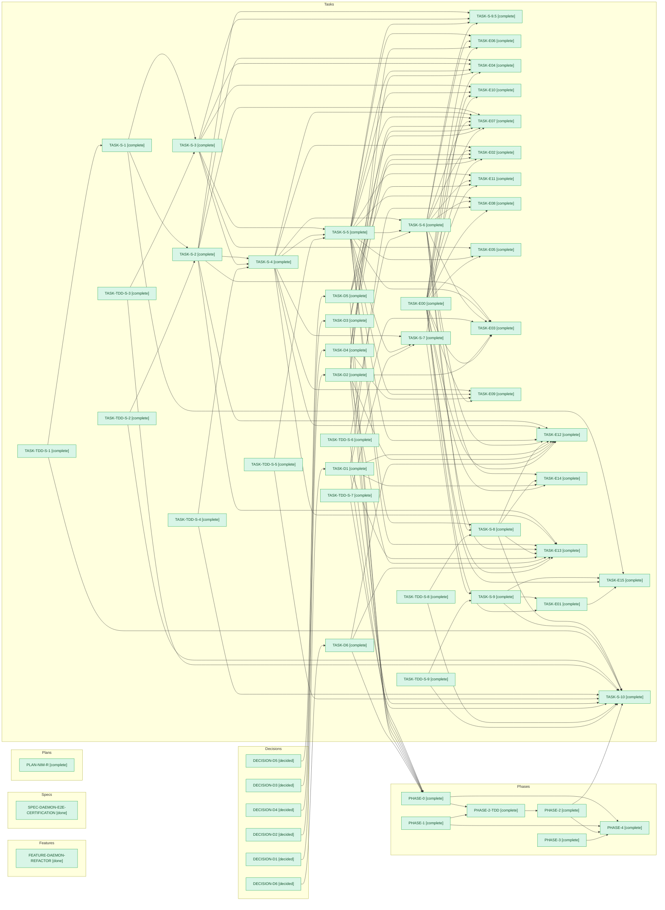
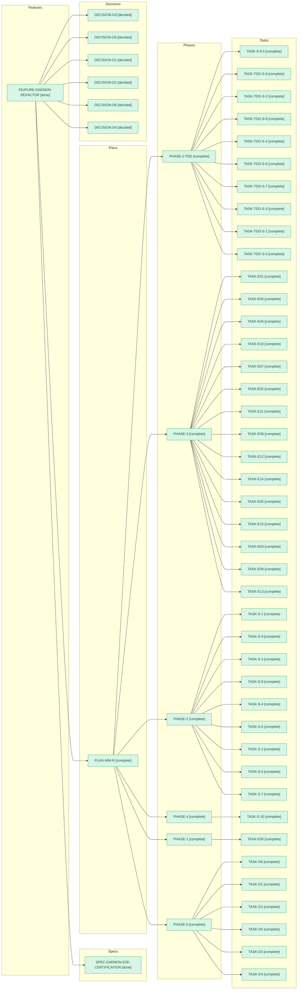

# Dependency DAG

```mermaid
graph LR
  subgraph group_feature["Features"]
    direction TB
    FEATURE_DAEMON_REFACTOR["FEATURE-DAEMON-REFACTOR [done]"]
    class FEATURE_DAEMON_REFACTOR internal-link
    class FEATURE_DAEMON_REFACTOR status_done
  end
  subgraph group_spec["Specs"]
    direction TB
    SPEC_DAEMON_E2E_CERTIFICATION["SPEC-DAEMON-E2E-CERTIFICATION [done]"]
    class SPEC_DAEMON_E2E_CERTIFICATION internal-link
    class SPEC_DAEMON_E2E_CERTIFICATION status_done
  end
  subgraph group_plan["Plans"]
    direction TB
    PLAN_NIM_R["PLAN-NIM-R [complete]"]
    class PLAN_NIM_R internal-link
    class PLAN_NIM_R status_complete
  end
  subgraph group_phase["Phases"]
    direction TB
    PHASE_0["PHASE-0 [complete]"]
    class PHASE_0 internal-link
    class PHASE_0 status_complete
    PHASE_1["PHASE-1 [complete]"]
    class PHASE_1 internal-link
    class PHASE_1 status_complete
    PHASE_4["PHASE-4 [complete]"]
    class PHASE_4 internal-link
    class PHASE_4 status_complete
    PHASE_2["PHASE-2 [complete]"]
    class PHASE_2 internal-link
    class PHASE_2 status_complete
    PHASE_3["PHASE-3 [complete]"]
    class PHASE_3 internal-link
    class PHASE_3 status_complete
    PHASE_2_TDD["PHASE-2-TDD [complete]"]
    class PHASE_2_TDD internal-link
    class PHASE_2_TDD status_complete
  end
  subgraph group_task["Tasks"]
    direction TB
    TASK_S_9_5["TASK-S-9.5 [complete]"]
    class TASK_S_9_5 internal-link
    class TASK_S_9_5 status_complete
    TASK_TDD_S_9["TASK-TDD-S-9 [complete]"]
    class TASK_TDD_S_9 internal-link
    class TASK_TDD_S_9 status_complete
    TASK_TDD_S_2["TASK-TDD-S-2 [complete]"]
    class TASK_TDD_S_2 internal-link
    class TASK_TDD_S_2 status_complete
    TASK_TDD_S_8["TASK-TDD-S-8 [complete]"]
    class TASK_TDD_S_8 internal-link
    class TASK_TDD_S_8 status_complete
    TASK_TDD_S_4["TASK-TDD-S-4 [complete]"]
    class TASK_TDD_S_4 internal-link
    class TASK_TDD_S_4 status_complete
    TASK_TDD_S_6["TASK-TDD-S-6 [complete]"]
    class TASK_TDD_S_6 internal-link
    class TASK_TDD_S_6 status_complete
    TASK_TDD_S_7["TASK-TDD-S-7 [complete]"]
    class TASK_TDD_S_7 internal-link
    class TASK_TDD_S_7 status_complete
    TASK_TDD_S_3["TASK-TDD-S-3 [complete]"]
    class TASK_TDD_S_3 internal-link
    class TASK_TDD_S_3 status_complete
    TASK_TDD_S_1["TASK-TDD-S-1 [complete]"]
    class TASK_TDD_S_1 internal-link
    class TASK_TDD_S_1 status_complete
    TASK_TDD_S_5["TASK-TDD-S-5 [complete]"]
    class TASK_TDD_S_5 internal-link
    class TASK_TDD_S_5 status_complete
    TASK_E01["TASK-E01 [complete]"]
    class TASK_E01 internal-link
    class TASK_E01 status_complete
    TASK_E06["TASK-E06 [complete]"]
    class TASK_E06 internal-link
    class TASK_E06 status_complete
    TASK_E04["TASK-E04 [complete]"]
    class TASK_E04 internal-link
    class TASK_E04 status_complete
    TASK_E10["TASK-E10 [complete]"]
    class TASK_E10 internal-link
    class TASK_E10 status_complete
    TASK_E07["TASK-E07 [complete]"]
    class TASK_E07 internal-link
    class TASK_E07 status_complete
    TASK_E02["TASK-E02 [complete]"]
    class TASK_E02 internal-link
    class TASK_E02 status_complete
    TASK_E11["TASK-E11 [complete]"]
    class TASK_E11 internal-link
    class TASK_E11 status_complete
    TASK_E08["TASK-E08 [complete]"]
    class TASK_E08 internal-link
    class TASK_E08 status_complete
    TASK_E12["TASK-E12 [complete]"]
    class TASK_E12 internal-link
    class TASK_E12 status_complete
    TASK_E14["TASK-E14 [complete]"]
    class TASK_E14 internal-link
    class TASK_E14 status_complete
    TASK_E05["TASK-E05 [complete]"]
    class TASK_E05 internal-link
    class TASK_E05 status_complete
    TASK_E15["TASK-E15 [complete]"]
    class TASK_E15 internal-link
    class TASK_E15 status_complete
    TASK_E03["TASK-E03 [complete]"]
    class TASK_E03 internal-link
    class TASK_E03 status_complete
    TASK_E09["TASK-E09 [complete]"]
    class TASK_E09 internal-link
    class TASK_E09 status_complete
    TASK_E13["TASK-E13 [complete]"]
    class TASK_E13 internal-link
    class TASK_E13 status_complete
    TASK_S_1["TASK-S-1 [complete]"]
    class TASK_S_1 internal-link
    class TASK_S_1 status_complete
    TASK_S_9["TASK-S-9 [complete]"]
    class TASK_S_9 internal-link
    class TASK_S_9 status_complete
    TASK_S_3["TASK-S-3 [complete]"]
    class TASK_S_3 internal-link
    class TASK_S_3 status_complete
    TASK_S_8["TASK-S-8 [complete]"]
    class TASK_S_8 internal-link
    class TASK_S_8 status_complete
    TASK_S_4["TASK-S-4 [complete]"]
    class TASK_S_4 internal-link
    class TASK_S_4 status_complete
    TASK_S_6["TASK-S-6 [complete]"]
    class TASK_S_6 internal-link
    class TASK_S_6 status_complete
    TASK_S_2["TASK-S-2 [complete]"]
    class TASK_S_2 internal-link
    class TASK_S_2 status_complete
    TASK_S_5["TASK-S-5 [complete]"]
    class TASK_S_5 internal-link
    class TASK_S_5 status_complete
    TASK_S_7["TASK-S-7 [complete]"]
    class TASK_S_7 internal-link
    class TASK_S_7 status_complete
    TASK_S_10["TASK-S-10 [complete]"]
    class TASK_S_10 internal-link
    class TASK_S_10 status_complete
    TASK_E00["TASK-E00 [complete]"]
    class TASK_E00 internal-link
    class TASK_E00 status_complete
    TASK_D6["TASK-D6 [complete]"]
    class TASK_D6 internal-link
    class TASK_D6 status_complete
    TASK_D1["TASK-D1 [complete]"]
    class TASK_D1 internal-link
    class TASK_D1 status_complete
    TASK_D2["TASK-D2 [complete]"]
    class TASK_D2 internal-link
    class TASK_D2 status_complete
    TASK_D5["TASK-D5 [complete]"]
    class TASK_D5 internal-link
    class TASK_D5 status_complete
    TASK_D3["TASK-D3 [complete]"]
    class TASK_D3 internal-link
    class TASK_D3 status_complete
    TASK_D4["TASK-D4 [complete]"]
    class TASK_D4 internal-link
    class TASK_D4 status_complete
  end
  subgraph group_decision["Decisions"]
    direction TB
    DECISION_D3["DECISION-D3 [decided]"]
    class DECISION_D3 internal-link
    class DECISION_D3 status_decided
    DECISION_D5["DECISION-D5 [decided]"]
    class DECISION_D5 internal-link
    class DECISION_D5 status_decided
    DECISION_D1["DECISION-D1 [decided]"]
    class DECISION_D1 internal-link
    class DECISION_D1 status_decided
    DECISION_D2["DECISION-D2 [decided]"]
    class DECISION_D2 internal-link
    class DECISION_D2 status_decided
    DECISION_D6["DECISION-D6 [decided]"]
    class DECISION_D6 internal-link
    class DECISION_D6 status_decided
    DECISION_D4["DECISION-D4 [decided]"]
    class DECISION_D4 internal-link
    class DECISION_D4 status_decided
  end
  TASK_D1 --> PHASE_0
  TASK_D2 --> PHASE_0
  TASK_D3 --> PHASE_0
  TASK_D4 --> PHASE_0
  TASK_D5 --> PHASE_0
  TASK_D6 --> PHASE_0
  PHASE_0 --> PHASE_4
  PHASE_1 --> PHASE_4
  PHASE_2 --> PHASE_4
  PHASE_3 --> PHASE_4
  PHASE_2_TDD --> PHASE_2
  PHASE_0 --> PHASE_2_TDD
  PHASE_1 --> PHASE_2_TDD
  TASK_S_2 --> TASK_S_9_5
  TASK_S_3 --> TASK_S_9_5
  TASK_S_5 --> TASK_S_9_5
  TASK_S_6 --> TASK_S_9_5
  TASK_S_9 --> TASK_E01
  TASK_E00 --> TASK_E01
  TASK_S_5 --> TASK_E06
  TASK_S_6 --> TASK_E06
  TASK_D2 --> TASK_E06
  TASK_E00 --> TASK_E06
  TASK_S_2 --> TASK_E04
  TASK_S_3 --> TASK_E04
  TASK_S_5 --> TASK_E04
  TASK_D2 --> TASK_E04
  TASK_E00 --> TASK_E04
  TASK_S_3 --> TASK_E10
  TASK_S_5 --> TASK_E10
  TASK_S_7 --> TASK_E10
  TASK_E00 --> TASK_E10
  TASK_S_2 --> TASK_E07
  TASK_S_4 --> TASK_E07
  TASK_S_5 --> TASK_E07
  TASK_S_6 --> TASK_E07
  TASK_D3 --> TASK_E07
  TASK_D4 --> TASK_E07
  TASK_D5 --> TASK_E07
  TASK_E00 --> TASK_E07
  TASK_S_4 --> TASK_E02
  TASK_S_6 --> TASK_E02
  TASK_D3 --> TASK_E02
  TASK_D4 --> TASK_E02
  TASK_D5 --> TASK_E02
  TASK_E00 --> TASK_E02
  TASK_S_5 --> TASK_E11
  TASK_S_6 --> TASK_E11
  TASK_D5 --> TASK_E11
  TASK_E00 --> TASK_E11
  TASK_S_5 --> TASK_E08
  TASK_S_6 --> TASK_E08
  TASK_D1 --> TASK_E08
  TASK_E00 --> TASK_E08
  TASK_S_2 --> TASK_E12
  TASK_S_4 --> TASK_E12
  TASK_S_5 --> TASK_E12
  TASK_S_6 --> TASK_E12
  TASK_S_8 --> TASK_E12
  TASK_D1 --> TASK_E12
  TASK_D2 --> TASK_E12
  TASK_D6 --> TASK_E12
  TASK_E00 --> TASK_E12
  TASK_S_6 --> TASK_E14
  TASK_S_8 --> TASK_E14
  TASK_D1 --> TASK_E14
  TASK_E00 --> TASK_E14
  TASK_S_3 --> TASK_E05
  TASK_S_5 --> TASK_E05
  TASK_E00 --> TASK_E05
  TASK_S_1 --> TASK_E15
  TASK_S_9 --> TASK_E15
  TASK_E00 --> TASK_E15
  TASK_E01 --> TASK_E15
  TASK_S_2 --> TASK_E03
  TASK_S_5 --> TASK_E03
  TASK_S_6 --> TASK_E03
  TASK_D1 --> TASK_E03
  TASK_D2 --> TASK_E03
  TASK_E00 --> TASK_E03
  TASK_S_4 --> TASK_E09
  TASK_S_5 --> TASK_E09
  TASK_D4 --> TASK_E09
  TASK_E00 --> TASK_E09
  TASK_S_2 --> TASK_E13
  TASK_S_4 --> TASK_E13
  TASK_S_5 --> TASK_E13
  TASK_S_6 --> TASK_E13
  TASK_S_8 --> TASK_E13
  TASK_D1 --> TASK_E13
  TASK_D2 --> TASK_E13
  TASK_D6 --> TASK_E13
  TASK_E00 --> TASK_E13
  TASK_TDD_S_1 --> TASK_S_1
  TASK_S_7 --> TASK_S_9
  TASK_TDD_S_9 --> TASK_S_9
  TASK_S_1 --> TASK_S_3
  TASK_TDD_S_3 --> TASK_S_3
  TASK_S_5 --> TASK_S_8
  TASK_S_6 --> TASK_S_8
  TASK_TDD_S_8 --> TASK_S_8
  TASK_S_2 --> TASK_S_4
  TASK_S_3 --> TASK_S_4
  TASK_TDD_S_4 --> TASK_S_4
  TASK_S_4 --> TASK_S_6
  TASK_S_5 --> TASK_S_6
  TASK_TDD_S_6 --> TASK_S_6
  TASK_S_1 --> TASK_S_2
  TASK_TDD_S_2 --> TASK_S_2
  TASK_S_3 --> TASK_S_5
  TASK_S_4 --> TASK_S_5
  TASK_TDD_S_5 --> TASK_S_5
  TASK_S_4 --> TASK_S_7
  TASK_S_5 --> TASK_S_7
  TASK_TDD_S_7 --> TASK_S_7
  TASK_S_8 --> TASK_S_10
  TASK_S_9 --> TASK_S_10
  TASK_TDD_S_1 --> TASK_S_10
  TASK_TDD_S_2 --> TASK_S_10
  TASK_TDD_S_3 --> TASK_S_10
  TASK_TDD_S_4 --> TASK_S_10
  TASK_TDD_S_5 --> TASK_S_10
  TASK_TDD_S_6 --> TASK_S_10
  TASK_TDD_S_7 --> TASK_S_10
  TASK_TDD_S_8 --> TASK_S_10
  TASK_TDD_S_9 --> TASK_S_10
  PHASE_2 --> TASK_S_10
  DECISION_D6 --> TASK_D6
  DECISION_D1 --> TASK_D1
  DECISION_D2 --> TASK_D2
  DECISION_D5 --> TASK_D5
  DECISION_D3 --> TASK_D3
  DECISION_D4 --> TASK_D4
  classDef status_complete fill:#d8f5e7,stroke:#16a34a,color:#14532d
  classDef status_decided fill:#d8f5e7,stroke:#16a34a,color:#14532d
  classDef status_done fill:#d8f5e7,stroke:#16a34a,color:#14532d
```

# Containment DAG

```mermaid
graph LR
  subgraph group_feature["Features"]
    direction TB
    FEATURE_DAEMON_REFACTOR["FEATURE-DAEMON-REFACTOR [done]"]
    class FEATURE_DAEMON_REFACTOR internal-link
    class FEATURE_DAEMON_REFACTOR status_done
  end
  subgraph group_spec["Specs"]
    direction TB
    SPEC_DAEMON_E2E_CERTIFICATION["SPEC-DAEMON-E2E-CERTIFICATION [done]"]
    class SPEC_DAEMON_E2E_CERTIFICATION internal-link
    class SPEC_DAEMON_E2E_CERTIFICATION status_done
  end
  subgraph group_plan["Plans"]
    direction TB
    PLAN_NIM_R["PLAN-NIM-R [complete]"]
    class PLAN_NIM_R internal-link
    class PLAN_NIM_R status_complete
  end
  subgraph group_phase["Phases"]
    direction TB
    PHASE_0["PHASE-0 [complete]"]
    class PHASE_0 internal-link
    class PHASE_0 status_complete
    PHASE_1["PHASE-1 [complete]"]
    class PHASE_1 internal-link
    class PHASE_1 status_complete
    PHASE_4["PHASE-4 [complete]"]
    class PHASE_4 internal-link
    class PHASE_4 status_complete
    PHASE_2["PHASE-2 [complete]"]
    class PHASE_2 internal-link
    class PHASE_2 status_complete
    PHASE_3["PHASE-3 [complete]"]
    class PHASE_3 internal-link
    class PHASE_3 status_complete
    PHASE_2_TDD["PHASE-2-TDD [complete]"]
    class PHASE_2_TDD internal-link
    class PHASE_2_TDD status_complete
  end
  subgraph group_task["Tasks"]
    direction TB
    TASK_S_9_5["TASK-S-9.5 [complete]"]
    class TASK_S_9_5 internal-link
    class TASK_S_9_5 status_complete
    TASK_TDD_S_9["TASK-TDD-S-9 [complete]"]
    class TASK_TDD_S_9 internal-link
    class TASK_TDD_S_9 status_complete
    TASK_TDD_S_2["TASK-TDD-S-2 [complete]"]
    class TASK_TDD_S_2 internal-link
    class TASK_TDD_S_2 status_complete
    TASK_TDD_S_8["TASK-TDD-S-8 [complete]"]
    class TASK_TDD_S_8 internal-link
    class TASK_TDD_S_8 status_complete
    TASK_TDD_S_4["TASK-TDD-S-4 [complete]"]
    class TASK_TDD_S_4 internal-link
    class TASK_TDD_S_4 status_complete
    TASK_TDD_S_6["TASK-TDD-S-6 [complete]"]
    class TASK_TDD_S_6 internal-link
    class TASK_TDD_S_6 status_complete
    TASK_TDD_S_7["TASK-TDD-S-7 [complete]"]
    class TASK_TDD_S_7 internal-link
    class TASK_TDD_S_7 status_complete
    TASK_TDD_S_3["TASK-TDD-S-3 [complete]"]
    class TASK_TDD_S_3 internal-link
    class TASK_TDD_S_3 status_complete
    TASK_TDD_S_1["TASK-TDD-S-1 [complete]"]
    class TASK_TDD_S_1 internal-link
    class TASK_TDD_S_1 status_complete
    TASK_TDD_S_5["TASK-TDD-S-5 [complete]"]
    class TASK_TDD_S_5 internal-link
    class TASK_TDD_S_5 status_complete
    TASK_E01["TASK-E01 [complete]"]
    class TASK_E01 internal-link
    class TASK_E01 status_complete
    TASK_E06["TASK-E06 [complete]"]
    class TASK_E06 internal-link
    class TASK_E06 status_complete
    TASK_E04["TASK-E04 [complete]"]
    class TASK_E04 internal-link
    class TASK_E04 status_complete
    TASK_E10["TASK-E10 [complete]"]
    class TASK_E10 internal-link
    class TASK_E10 status_complete
    TASK_E07["TASK-E07 [complete]"]
    class TASK_E07 internal-link
    class TASK_E07 status_complete
    TASK_E02["TASK-E02 [complete]"]
    class TASK_E02 internal-link
    class TASK_E02 status_complete
    TASK_E11["TASK-E11 [complete]"]
    class TASK_E11 internal-link
    class TASK_E11 status_complete
    TASK_E08["TASK-E08 [complete]"]
    class TASK_E08 internal-link
    class TASK_E08 status_complete
    TASK_E12["TASK-E12 [complete]"]
    class TASK_E12 internal-link
    class TASK_E12 status_complete
    TASK_E14["TASK-E14 [complete]"]
    class TASK_E14 internal-link
    class TASK_E14 status_complete
    TASK_E05["TASK-E05 [complete]"]
    class TASK_E05 internal-link
    class TASK_E05 status_complete
    TASK_E15["TASK-E15 [complete]"]
    class TASK_E15 internal-link
    class TASK_E15 status_complete
    TASK_E03["TASK-E03 [complete]"]
    class TASK_E03 internal-link
    class TASK_E03 status_complete
    TASK_E09["TASK-E09 [complete]"]
    class TASK_E09 internal-link
    class TASK_E09 status_complete
    TASK_E13["TASK-E13 [complete]"]
    class TASK_E13 internal-link
    class TASK_E13 status_complete
    TASK_S_1["TASK-S-1 [complete]"]
    class TASK_S_1 internal-link
    class TASK_S_1 status_complete
    TASK_S_9["TASK-S-9 [complete]"]
    class TASK_S_9 internal-link
    class TASK_S_9 status_complete
    TASK_S_3["TASK-S-3 [complete]"]
    class TASK_S_3 internal-link
    class TASK_S_3 status_complete
    TASK_S_8["TASK-S-8 [complete]"]
    class TASK_S_8 internal-link
    class TASK_S_8 status_complete
    TASK_S_4["TASK-S-4 [complete]"]
    class TASK_S_4 internal-link
    class TASK_S_4 status_complete
    TASK_S_6["TASK-S-6 [complete]"]
    class TASK_S_6 internal-link
    class TASK_S_6 status_complete
    TASK_S_2["TASK-S-2 [complete]"]
    class TASK_S_2 internal-link
    class TASK_S_2 status_complete
    TASK_S_5["TASK-S-5 [complete]"]
    class TASK_S_5 internal-link
    class TASK_S_5 status_complete
    TASK_S_7["TASK-S-7 [complete]"]
    class TASK_S_7 internal-link
    class TASK_S_7 status_complete
    TASK_S_10["TASK-S-10 [complete]"]
    class TASK_S_10 internal-link
    class TASK_S_10 status_complete
    TASK_E00["TASK-E00 [complete]"]
    class TASK_E00 internal-link
    class TASK_E00 status_complete
    TASK_D6["TASK-D6 [complete]"]
    class TASK_D6 internal-link
    class TASK_D6 status_complete
    TASK_D1["TASK-D1 [complete]"]
    class TASK_D1 internal-link
    class TASK_D1 status_complete
    TASK_D2["TASK-D2 [complete]"]
    class TASK_D2 internal-link
    class TASK_D2 status_complete
    TASK_D5["TASK-D5 [complete]"]
    class TASK_D5 internal-link
    class TASK_D5 status_complete
    TASK_D3["TASK-D3 [complete]"]
    class TASK_D3 internal-link
    class TASK_D3 status_complete
    TASK_D4["TASK-D4 [complete]"]
    class TASK_D4 internal-link
    class TASK_D4 status_complete
  end
  subgraph group_decision["Decisions"]
    direction TB
    DECISION_D3["DECISION-D3 [decided]"]
    class DECISION_D3 internal-link
    class DECISION_D3 status_decided
    DECISION_D5["DECISION-D5 [decided]"]
    class DECISION_D5 internal-link
    class DECISION_D5 status_decided
    DECISION_D1["DECISION-D1 [decided]"]
    class DECISION_D1 internal-link
    class DECISION_D1 status_decided
    DECISION_D2["DECISION-D2 [decided]"]
    class DECISION_D2 internal-link
    class DECISION_D2 status_decided
    DECISION_D6["DECISION-D6 [decided]"]
    class DECISION_D6 internal-link
    class DECISION_D6 status_decided
    DECISION_D4["DECISION-D4 [decided]"]
    class DECISION_D4 internal-link
    class DECISION_D4 status_decided
  end
  FEATURE_DAEMON_REFACTOR --> DECISION_D3
  FEATURE_DAEMON_REFACTOR --> DECISION_D5
  FEATURE_DAEMON_REFACTOR --> DECISION_D1
  FEATURE_DAEMON_REFACTOR --> DECISION_D2
  FEATURE_DAEMON_REFACTOR --> DECISION_D6
  FEATURE_DAEMON_REFACTOR --> DECISION_D4
  FEATURE_DAEMON_REFACTOR --> SPEC_DAEMON_E2E_CERTIFICATION
  FEATURE_DAEMON_REFACTOR --> PLAN_NIM_R
  PLAN_NIM_R --> PHASE_0
  PLAN_NIM_R --> PHASE_1
  PLAN_NIM_R --> PHASE_4
  PLAN_NIM_R --> PHASE_2
  PLAN_NIM_R --> PHASE_3
  PLAN_NIM_R --> PHASE_2_TDD
  PHASE_2_TDD --> TASK_S_9_5
  PHASE_2_TDD --> TASK_TDD_S_9
  PHASE_2_TDD --> TASK_TDD_S_2
  PHASE_2_TDD --> TASK_TDD_S_8
  PHASE_2_TDD --> TASK_TDD_S_4
  PHASE_2_TDD --> TASK_TDD_S_6
  PHASE_2_TDD --> TASK_TDD_S_7
  PHASE_2_TDD --> TASK_TDD_S_3
  PHASE_2_TDD --> TASK_TDD_S_1
  PHASE_2_TDD --> TASK_TDD_S_5
  PHASE_3 --> TASK_E01
  PHASE_3 --> TASK_E06
  PHASE_3 --> TASK_E04
  PHASE_3 --> TASK_E10
  PHASE_3 --> TASK_E07
  PHASE_3 --> TASK_E02
  PHASE_3 --> TASK_E11
  PHASE_3 --> TASK_E08
  PHASE_3 --> TASK_E12
  PHASE_3 --> TASK_E14
  PHASE_3 --> TASK_E05
  PHASE_3 --> TASK_E15
  PHASE_3 --> TASK_E03
  PHASE_3 --> TASK_E09
  PHASE_3 --> TASK_E13
  PHASE_2 --> TASK_S_1
  PHASE_2 --> TASK_S_9
  PHASE_2 --> TASK_S_3
  PHASE_2 --> TASK_S_8
  PHASE_2 --> TASK_S_4
  PHASE_2 --> TASK_S_6
  PHASE_2 --> TASK_S_2
  PHASE_2 --> TASK_S_5
  PHASE_2 --> TASK_S_7
  PHASE_4 --> TASK_S_10
  PHASE_1 --> TASK_E00
  PHASE_0 --> TASK_D6
  PHASE_0 --> TASK_D1
  PHASE_0 --> TASK_D2
  PHASE_0 --> TASK_D5
  PHASE_0 --> TASK_D3
  PHASE_0 --> TASK_D4
  classDef status_complete fill:#d8f5e7,stroke:#16a34a,color:#14532d
  classDef status_decided fill:#d8f5e7,stroke:#16a34a,color:#14532d
  classDef status_done fill:#d8f5e7,stroke:#16a34a,color:#14532d
```
